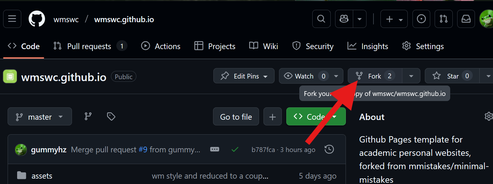
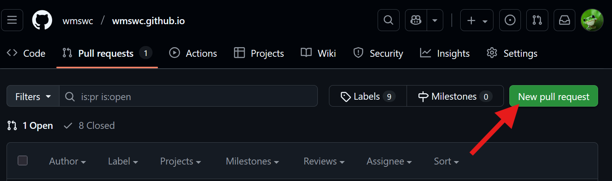
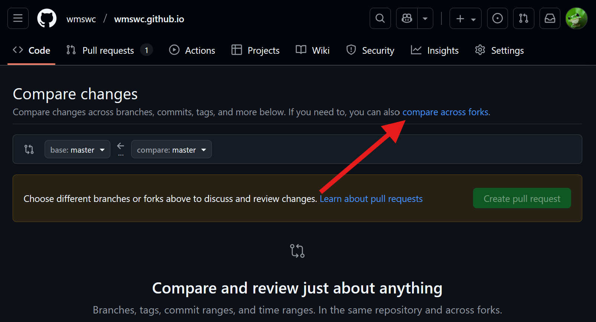
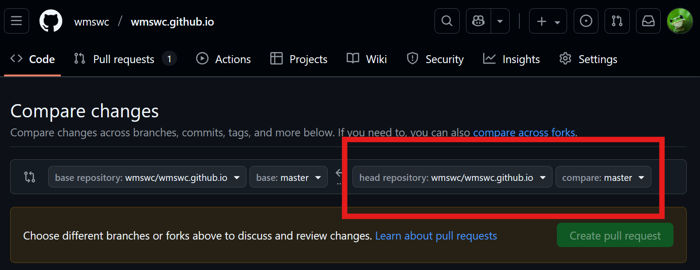
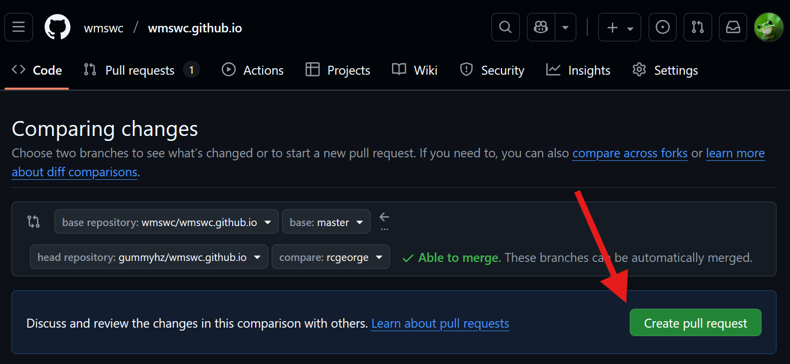

# W&M Robotics Club Website
William and Mary's Robotics Club Website.
Big Thank You to SWC and @gummyhz


## Maintenance Walkthrough
The screenshots are reused from SWC but the workflow is the same~

(Of course if you had the right permissions, you could directly edit the website and push to master, but these instructions are written for the more general club body who may not have write permissions.)

Prerequities: Github account, read access to this repo

1. [Fork](https://docs.github.com/en/pull-requests/collaborating-with-pull-requests/working-with-forks/fork-a-repo) the repository


2. [Clone](https://docs.github.com/en/repositories/creating-and-managing-repositories/cloning-a-repository) the website onto your machine 

with ssh:
```
$ git clone git@github.com:<USERNAME>/wmswc.github.io.git
```
with html:
    
```
$ git clone https://github.com/<USERNAME>/wmswc.github.io.git
```

3. Go to your cloned repository
```
$ cd wmswc.github.io/
```

4. Add the original repository as a remote, "upstream"
```
$ git remote add upstream git@github.com:wmswc/wmswc.github.io.git
```
In the future, you might want to get the remote's changes using:
```
$ git fetch upstream
$ git merge upstream
```

5. [Make a branch](https://git-scm.com/docs/git-checkout/2.0.5) for your changes
    - here we will make (`-b`) and move onto (`checkout`) a new branch (`your-branch-name`) which is based on the branch `master` from our original repository (`upstream`)
```
$ git checkout -b your-branch-name upstream/master
```

6. Make changes

7. [Commit](https://github.com/git-guides/git-commit) your changes \
For example:
```
$ git add --all
$ git commit -m "short description of changes"
$ git push -u origin your-branch-name
```

8. Create a [pull request](https://docs.github.com/en/pull-requests/collaborating-with-pull-requests/proposing-changes-to-your-work-with-pull-requests/creating-a-pull-request) \
One way to do this is by
    1. Clicking on 'New pull request' on pull request tab of the original repo

    2. Clicking 'compare across forks'

    3. Selecting your fork and selecting your changes' branch from the dropdowns

    4. Clicking 'Create pull request'
    
    5. Editing the title and description of your pull request, then submitting it
    

9. Ask someone with write permissions to approve and merge your pull request